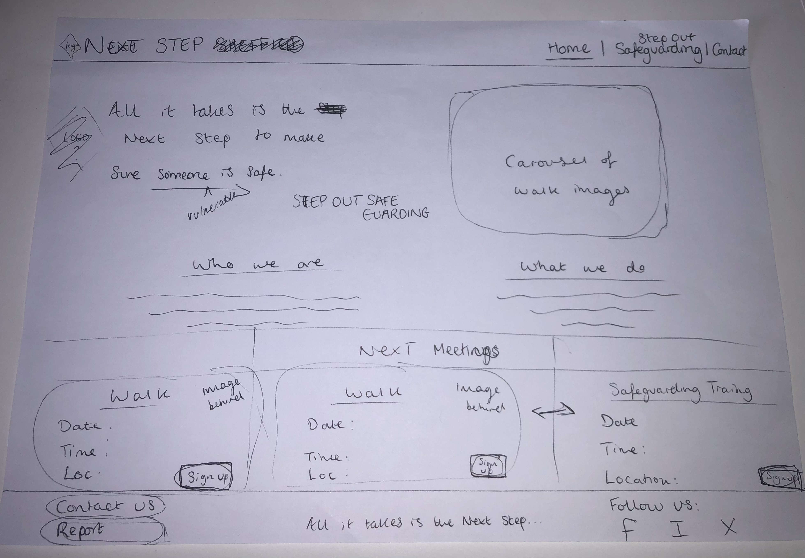
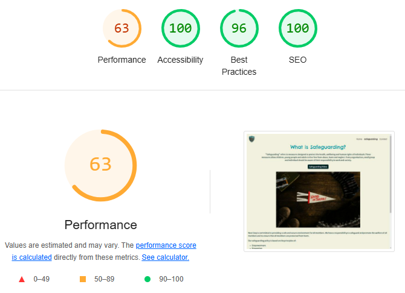

# Next Step Safeguarding

My static website will be based on a fictitious walking group called Next Step and will feature their webpages on safeguarding and how they approach safeguarding issues in the club. I was inspired to create some webpages on the topic of safeguarding because it was a task we had to complete as part of the university walking club I was a part of. I think it is an absolutely vital topic to learn about so my aim is to create an easy to use site with clear information and call to action points in case the need to report a safeguarding issue occurs. 

Live site can be found here: [Next Step Safeguarding](https://phoebew17.github.io/NextStepSafeguarding)

---

## CONTENTS

* [User Experience](#user-experience-ux)
  * [User Stories](#user-stories)

* [Design](#design)
  * [Colour Scheme](#colour-scheme)
  * [Typography](#typography)
  * [Imagery](#imagery)
  * [Wireframes](#wireframes)

* [Features](#features)
  * [General Features on Each Page](#general-features-on-each-page)
  * [Future Implementations](#future-implementations)
  * [Accessibility](#accessibility)

* [Technologies Used](#technologies-used)
  * [Languages Used](#languages-used)
  * [Frameworks, Libraries & Programs Used](#frameworks-libraries--programs-used)

* [Deployment & Local Development](#deployment--local-development)
  * [Deployment](#deployment)
  * [Local Development](#local-development)
    * [How to Fork](#how-to-fork)
    * [How to Clone](#how-to-clone)

* [Testing](#testing)

* [Credits](#credits)
  * [Code Used](#code-used)
  * [Content](#content)
  * [Media](#media)
  * [Acknowledgments](#acknowledgments)

---

## User Experience (UX)

## Initial Discussion

Next Step is a website for a fictitious walking group local to Sheffield. The website requires some pages on safeguarding so that it's members are aware of the topic and know what to do if a safeguarding concern arises on a walk or a concern is linked to a walking club member.

**Key information for the site**

- What is safeguarding?
- Signs to watch out for.
- Action steps.
- Contact page with links and information on how to report an issue.
- Information about the club, upcoming walks and training.

### User Stories

1. As a user, I want to easily find the safeguarding page on the website so that I can quickly access important information.
2. As a club member, I want an easy-to-use form on the website to report any safeguarding concerns so that I can alert the club.
3. As a member I want to find information on upcoming walks and training so that I can sign up for them.

**First Time Visitor Goals**

- To find information about the walking club.
- To find information on safeguarding related to the club.
- To to be able to navigate the site easily to find the information they need.
- To connect to the club's social sites.

**Returning Visitor Goals**

- To be able to see the up to date information on meetings and training.
- To access the contact form quickly.

## Design

I knew I wanted the club to have a logo, so I began by drawing out a very rough design. I then asked Microsoft Copilot to produce a logo with the description and design features I required. 

Starting Idea: 

Final design from Copilot: 

### Colour Scheme

Following on from the logo design, I was able to extract the colours via Adobe Color in order to create a colour scheme for the website as a whole. The range of blues alongside the brown will help to provide a feel of the outdoors and the freedom the walks can give to people. The shade of cream is also gentle and allows for good contrast. 

The contrast was tested for accessibility:

### Typography

I have used Google Fonts to import the chosen fonts for the website. 

I have chosen to use Chelsea Market by Tart Workshop for headings. This font has a rustic feel which replicates the outdoors, whilst being clear to read.

I have chosen to use Merriweather Sans by Sorkin Type for paragraphs. For larger blocks of text, this sans serif font is simple and clear to read. 

### Imagery

The imagery focusses on both group togetherness on hikes and safeguarding. I have mostly used photography from UnSplash and my own library. I have used AI generated images for the logo and hero image on the contact page. I used Copilot to create the hero image. This allowed me to depict a scene of togetherness whilst highlghting that sometimes people who are vulnerable and struggling can be hidden in plain sight. 

The images have been credited in the [credits](#credits) section of the ReadMe.

### Wireframes

Mobile First Design: 

Home Page Design: 

Safeguarding Page Design:

## Features

### The home page features:

- Navigation bar with title and logo with links to further pages on Safeguarding and Contact.
- A header with a slogan and button to the safeguarding page.
- A carousel of images from walks.
- Two Bootstrap cards on ‘Who we are?’ and ‘What we do?’
- A section on Next meetings with two fake walks and a training day in safeguarding hosted by the club.
- Footer with the slogan, socials and links to reporting/ contacting us.

### The safeguarding page features:

- Navigation and Footer will remain the same.
- A header what is safeguarding?
- A link to a video
- A section on club policy and guidance.

### General features on each page

- Navigation bar with title and logo with links to further pages on Safeguarding and Contact.
- Footer with socials and links to reporting/ contacting us.
- Logo

### Future Implementations

I would like to add more structure to the Safeguarding page by adding some Bootstrap cards with more specific information titled "What can you do?", "Signs to Look For" and "Action Steps". 

Additionally I would embed the video so it can be accessed easily without leaving the site. 

 I would include a contact page: 

### **The contact page features:**

- Navigation bar and footer will remain the same with additional more info.
- A contact form
- a hero image

Contact Page Design: 

### Accessibility

I have used icons and added aria-labels to enable screen readers to understand these.
I have used alt to describe images.
My site meets the minimum contrast requirements.
I have chosen fonts that are dyslexia/accessible friendly.

## Technologies Used

### Languages Used

I used HTML and CSS to create my website.

### Frameworks, Libraries & Programs Used

Github 

Bootstrap version 5.3

Google Fonts

Font Awesome

Google Dev Tools

Cloud Convert To convert images to WEBP files.

Favicon

## Deployment & Local Development

### Deployment

I utilised Github Pages to deploy my static site. Please find a guide on how to do so below:

1. Log in to Github.
2. Find the repository called NextStepSafeguarding.
3. Click on the settings icon.
4. On the left hand side in the navigation page, find the Pages link.
5. In the  Branch section of Build and Deploy, make sure to choose main from the drop down menu. then select Root in the folder drop menu.
6. Click Save. The site is now live and can be accessed via the URL. This can also be found on the repository homepage.

### Local Development

#### How to Fork

To fork the NextStepSafeguarding repository:

1. Log in to Github.
2. Find the NextStepSafeguarding repository.
3. Find the fork button in the top right hand corner.

#### How to Clone

To clone the NextStepSafeguarding repository:

1. Log in to Github.
2. Find the NextStepSafeguarding repository.
3. Click on the code button, in the clone section select the option you desire to clone the project with. Then copy the URL.
4. Open the terminal in your code editor and change the current working directory to the location you want to use for the cloned directory.
5. Type 'git clone' into the terminal and then paste the link you copied in step 3. Press enter.

## Testing

I utilised Google Dev Tools to identify any bugs as I went along. 

I utilised Microsoft Copilot in the browser to strengthen my knowledge, for example defining parts of the Bootstrap framework.

I got advice from the coding coach in a open call regarding specific advice on Bootstrap framework and he helped me align the buttons within the footer.

I got further advice in the SME open call to reposition the carousel feature. Spencer was able to pinpoint the bug and changed the code snippet for me. 

### W3C Validator 

### Lighthouse

I utilised Lighthouse in Google Dev Tools to check the overral performance of my site.

The Home page on mobile: 

The Home page on desktop:

The Safeguarding page on mobile:

The Safeguarding page on desktop:

### Full testing

I have tested both pages on various devices (iPhone X, iPad Air, HP laptop with widescreen connected) in IOS, Chrome and Duckduckgo. 

I used Google Developer tools to check responsivity across screen sizes. 

1. Test links on Home page: Next Step button links to Safeguarding page, works as expected.
2. Contact Us on Home page: failed due to lack of page to connect to.
3. Instagram on Home page: Links to an external page on web, works as expected.
4. Facebook on Home page: Links to an external page on web, works as expected.
5. X on Home page: Links to an external page on web, works as expected.
6. Github on Home page: Links to an external page on web, works as expected.
7. Safeguarding video on Safeguarding page: Links to an external page on web, works as expected.

## Credits

### Code Used

If you have used some code in your project that you didn't write, this is the place to make note of it. Credit the author of the code and if possible a link to where you found the code. You could also add in a brief description of what the code does, or what you are using it for here.

The learning materials produced by Code Institute. I utilised parts of the Love Running project and also Boardwalk Games. These sections are marked with a comment in the code. 

Github Copilot - both inline and the chat function were used to correct lines of code and provide snippets as mini templates which I could style. These sections are marked with a comment in the code.

I used Bootstrap to form the carousel, card elements, buttons and navbar. 

### Content

The content on the Home page was written by Phoebe Whiteley. I utlised Copilot to produce part of the text on the Safeguarding page.

Websites I used for research: 

[Safeguarding in Sports Clubs](https://www.sportengland.org/guidance-and-support/safeguarding)

[NSPCC Safeguarding in Sport](https://learning.nspcc.org.uk/safeguarding-child-protection/what-is-safeguarding-in-sport)

[Walking Group Safety](https://www.ramblers.org.uk/advice/safety/group-walks.aspx)

[Ann Craft Trust - What is Safeguarding?](https://www.anncrafttrust.org/resources/what-is-safeguarding/) - Text used from this site.

ReadMe: 

[ReadMe Template](https://github.com/kera-cudmore/readme-examples/blob/main/milestone1-readme.md)

###  Media

Logo - Created by Microsoft Copilot

Images: 

Annie Spratt, Hannah Busing, MChe Lee, Chang Duong on Unsplash

Lake District image - James L 

Links: 

[Sheffield City Council First Contact Team](https://www.sheffield.gov.uk/social-care/adults/adult-abuse)

[A Video Introduction to Safeguarding Adults in Sport](https://www.anncrafttrust.org/resources/a-video-introduction-to-safeguarding-adults-in-sport)
  
###  Acknowledgments

Amy Richardson - our Bootcamp group facilitator, thank you for your constant positive energy and feedback!

Roo Macarthur - Bootcamp Coding Coach, thank you for the help with Bootstrap framework. 

Spencer Barriball - Bootcamp SME, thank you for your help and for finding the missing row class!

The South Yorkshire group - thanks for support on Slack!
